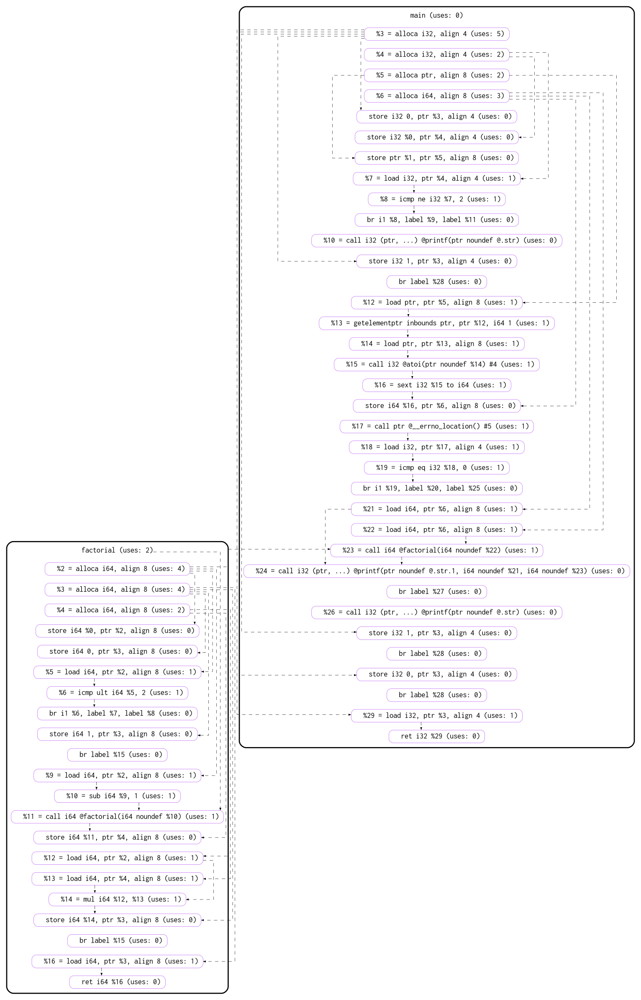

# llvm-dot-pass

## Prerequisites

In order to use this pass, you have to install the LLVM and its development headers on your system. I strongly recommend to do this with your package manager if you're on Linux.

## Usage

Simply clone the repo to a location of your choice and change to that directory:

```
git clone https://github.com/d3phys/llvm-dot-pass.git
cd llvm-dot-pass
```

Build pass:
```
cd build
cmake ..
make
```

Then go to samples folder and run static instrumentation script:
```
cd ../samples
./run.sh fact
```

To study dynamic instrumentation, run the program:
```
./fact.exe 4
...
```

Possible output graph:



